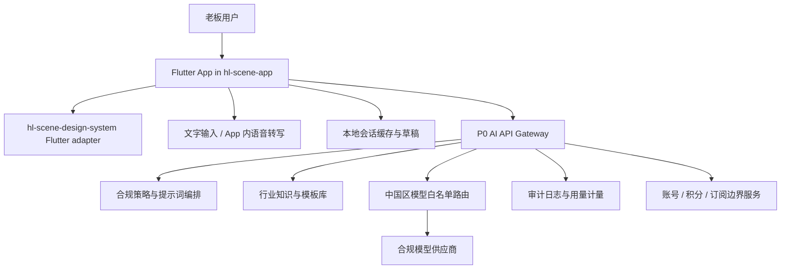

# 新美业 AI 老板总助 App P0 系统架构

**文档编号**：NEW-BEAUTY-AI-P0-SYSTEM-ARCH
**版本**：v0.1
**状态**：DRAFT v0.1
**日期**：2026-04-28
**市场**：中国大陆
**产品**：新美业 AI 老板总助 App
**Mode**：Mode B / Hardware-as-Substrate
**承载仓**：`hl-scene-app`（后续工程实现，不在本任务写入）
**设计系统**：`hl-scene-design-system` Flutter adapter
**首版 ICP**：1-3 家门店的单店/小连锁美业老板

**上游依据**：
- `tzhOS` R-0099 / AER-MODEL Mode B
- `hl-contracts` R-FE-CLIENT-001
- `hl-dispatch` DD-FE-CLIENT-v1
- `hl-contracts` R-036 amend-002（DS token-core + Flutter adapter + UniApp adapter）

---

## 1. 总体架构图

架构原则：
- P0 App 是移动端承载层，不直接绑定任何门店经营系统。
- AI 能力通过服务端网关统一编排模型、提示词、模板、审计与限流。
- 模型供应商只经白名单路由进入生产调用链。
- 设计系统消费 `hl-scene-design-system` Flutter adapter，不在 App 仓复制 token 真源。

## 2. 数据流

### 2.1 P0 标准请求流

1. 用户输入文字或使用 App 内语音转写。
2. App 形成对话请求，附带用户手动填写的门店背景和当前场景。
3. API Gateway 生成 trace_id，进入策略检查。
4. 提示词编排层选择场景模板、行业知识片段、合规边界。
5. 模型白名单路由选择生产可用模型。
6. 模型输出返回策略层做后处理与风险提示。
7. App 展示回答、行动清单、模板草稿。
8. 审计层记录请求类别、模型版本、提示词版本、用量与风险标签。

### 2.2 语音转写流

1. 用户在 App 内主动点击录音。
2. 录音只用于本次转写，不持续录音，不后台录音。
3. 转写文本进入与文字输入相同的请求流。
4. 原始音频是否保留、保留多久、是否上传，需由后续工程合规方案另行确认；P0 默认不把音频作为长期业务数据。

### 2.3 草稿流

1. AI 生成文案、SOP、活动方案、回复模板。
2. 用户人工复核。
3. 用户手动复制、分享或导出。
4. P0 不自动群发，不调用营销系统，不修改客户资产。

## 3. 主要模块

| 模块 | 职责 | P0 约束 |
|---|---|---|
| Flutter App Shell | 登录态、导航、对话、模板、收藏、历史 | 实现目标仓为 `hl-scene-app`，本任务不写入 |
| DS Adapter | 页面组件、颜色、字号、间距、状态样式 | 只消费 `hl-scene-design-system` Flutter adapter |
| Input Layer | 文字输入、主动录音、语音转写结果编辑 | 不持续录音，不后台运行 |
| Conversation Orchestrator | 场景选择、上下文组装、澄清问题 | 仅使用用户手动输入和模板上下文 |
| Prompt Registry | 提示词版本、场景模板、风险边界 | 后续需可审计、可回滚 |
| Knowledge Pack | 新美业行业知识、经营模板、沟通模板 | 不包含真实门店私有数据 |
| Model Router | 中国区模型白名单、降级、限流 | 生产只走白名单 |
| Safety Policy | 医疗、隐私、营销、夸大表达控制 | 禁止医疗诊断、治疗建议、处方、疗效承诺 |
| Usage Metering | token、次数、积分、套餐权益 | P0 定边界，不锁支付实现 |
| Audit Log | trace_id、模型版本、提示词版本、风险标签 | 支持审核态与生产态一致性核验 |

## 4. 模型白名单策略

### 4.1 中国区生产策略

- 生产只使用中国大陆合规白名单模型。
- 白名单字段至少包括：供应商、模型名、版本、用途、可用区域、审核状态、成本档、降级模型。
- 审核态等于真实生产态，审核包不得使用与生产不同的模型路径。
- 模型输出必须通过统一后处理，补充必要免责声明和边界提示。

### 4.2 内部 benchmark 策略

- OpenAI / Claude / Gemini 可作为内部 benchmark 与提示词评测参照。
- benchmark 结果只用于质量比较、提示词迭代和用例回归。
- OpenAI / Claude / Gemini 不进入 P0 中国公开上架版生产依赖。

## 5. 积分/订阅边界

P0 可定义以下产品边界：
- 免费试用次数。
- 每日或每月 AI 次数。
- 积分消耗规则。
- 套餐权益展示。
- 用量不足时的升级提示。

P0 不在本架构中锁定：
- 支付通道。
- 发票与税务流程。
- 退款策略。
- 渠道分成。
- 复杂企业采购。

任一计费能力进入生产前，需补充支付、财税、风控、客服和应用市场合规验收。

## 6. P0/P1 数据边界

| 数据类别 | P0 | P1 评估方向 |
|---|---|---|
| 用户手动输入 | 支持 | 支持 |
| 行业知识 | 支持 | 支持，可版本化 |
| 模板 | 支持 | 支持，可运营后台管理 |
| 对话上下文 | 支持 | 支持，可跨设备同步 |
| 真实预约数据 | 不接入 | 另行立项 |
| 真实客户数据 | 不接入 | 另行立项并做隐私评估 |
| 排班/库存/营销系统数据 | 不接入 | 另行立项 |
| 硬件音频流 | 不接入 | 另行立项 |
| 自动执行结果 | 不产生 | 另行立项 |

## 7. 安全与审计

### 7.1 安全基线

- 最小化采集：P0 不要求用户输入客户姓名、手机号、病史、照片等敏感信息。
- 明示边界：输入框附近和首次使用流程提示用户避免输入敏感个人信息。
- 会话隔离：不同账号的历史对话不可互相访问。
- 传输保护：App 到服务端使用 HTTPS。
- 本地保护：本地 token 使用平台安全存储方案，具体实现由 `hl-scene-app` 工程方案确认。

### 7.2 审计字段

建议记录：
- trace_id。
- user_id 或匿名会话标识。
- 场景类型。
- prompt_template_id。
- prompt_version。
- knowledge_pack_version。
- model_provider。
- model_name。
- model_version。
- token_usage。
- safety_labels。
- created_at。

### 7.3 审计验收

- 任一生产回答可追溯到模型版本、提示词版本和知识包版本。
- 审核态请求与生产态请求走同一模型白名单路径。
- 禁止记录用户粘贴的完整敏感个人信息作为长期审计明文。
- 合规拒答、降级、人工复核提示需要形成可抽样检查的日志。
